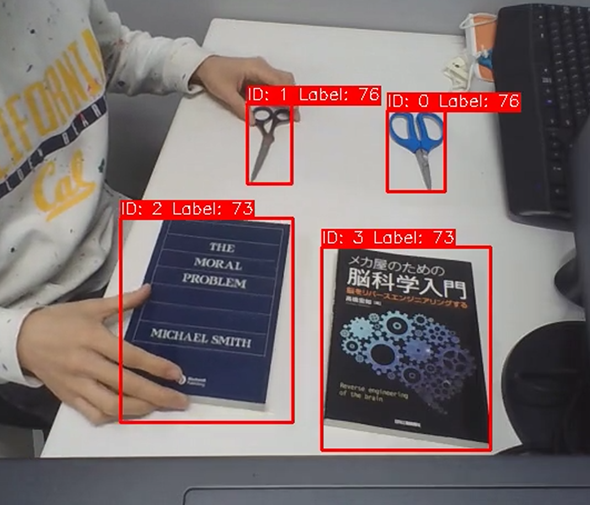

# ROS2 Object Tracking Pipeline

A ROS2 Humble based object tracking system that performs:

- **YOLOv10m-based object detection** for designated object classes
- **Multiple object tracking** using **SORT** (Simple Online and Realtime Tracking)
- **Tracked result visualization** with bounding boxes and IDs
- **CSV export** of tracked trajectories
- **Docker / Docker Compose based execution**

This project was implemented as a ROS object tracking take-home assignment and satisfies the core requirements of:

- ROS2-based modular node design
- Dockerized setup and execution
- Configurable runtime
- Basic testing support
- Output visualization and CSV logging


### [Demo video 1 (Offline tracking with CPU (AMD Ryzen 5 7645HX with Radeon Graphics) : 2 Hz)](samples/test1_cpu.mp4)
### [Demo video 2 (Real-time tracking with GPU (NVIDIA GeForce RTX 4050 Laptop GPU) : 10 Hz))](samples/test2_gpu.mp4)
---

## 1. Overview

The system consists of two ROS2 nodes:

1. **YOLO node**
   - Loads a TorchScript YOLOv10m model
   - Performs object detection
   - Publishes detection results as a custom ROS2 message

2. **Tracker node**
   - Send video images to YOLO node every time YOLO detections are subscribed.
   - Subscribes to detections
   - Associates detections across frames using **SORT**
   - Draws tracking results
   - Saves tracked data to CSV
   - Optionally saves an output video

The current implementation supports two input modes:

- **ROS image topic / webcam mode**
- **Video-file mode** using a configured input video path

Because webcam access in Docker Desktop + WSL2 can be limited depending on host configuration, video-file mode is also supported for reproducible testing.

---

## 2. Technologies and environment

### ROS distribution
- **ROS2 Humble**

### Language
- **C++17**

### Main libraries
- ROS2 (`rclcpp`, `sensor_msgs`, `std_msgs`, custom messages)
- OpenCV
- PyTorch / LibTorch (TorchScript runtime)
- Docker / Docker Compose

---

## 3. Repository structure

```text
object_tracking_linux/
├── docker/
│   ├── Dockerfile
│   ├── docker-compose.yml
│   └── ros_entrypoint.sh
├── ros_ws/
│   ├── src/
│   │   └── tracker_pkg/
│   │       ├── CMakeLists.txt
│   │       ├── package.xml
│   │       ├── include/tracker_pkg/
│   │       ├── src/
│   │       ├── msg/
│   │       ├── config/
│   │       ├── tests/
│   │       └── video/
│   ├── build/
│   ├── install/
│   └── log/
├── make_torchscript/
│   └── makeTorchScript.ipynb
├── analysis/
├──.pre-commit-config.yaml
├── Makefile
└── README.md
```

## 4. System Architecture
### Nodes
- yolo_node
	Subscribes to /camera/image_raw
		Loads a TorchScript YOLOv10m model
		Performs object detection for designated object classes
	Publishes detection results to /yolo/detections 

- tracker_node
	Subscribes to /yolo/detections
		Uses ROS image input or a configured video file
		Associates detections across frames using SORT
		Displays tracking results
		Saves tracked trajectories to CSV
		Optionally saves output video
	Publishes video images to /camera/image_raw 
- Topics
	Input image topic
		/camera/image_raw
		Type: sensor_msgs/msg/Image
	Detection topic
		/yolo/detections
		Type: custom message tracker_pkg/msg/Detection2DArray

## 5. Tracking Approach
- Detector: YOLOv10m exported as TorchScript
- Tracker: SORT-based association
	Kalman filter prediction
	distance and size-based association
	Hungarian algorithm matching
- Output
	Bounding box visualization with object IDs
	CSV export of tracked objects
	Optionally save video

## 6. Runtime Configuration
- Main config file
```sh
%/ros_ws/src/tracker_pkg/config/default.txt

#contents
display true #display the tracking results in realtime.
time_capture 70
video_path /ros_ws/src/tracker_pkg/video/test1_original/video.mp4

yolo_path /ros_ws/src/tracker_pkg/config/yolov10m_w640_h480_cpu.torchscript
yoloWidth 640
yoloHeight 480
IoU_threshold 0.7 
conf_threshold 0.3 

object_index 73,76
```
- parameters:
	- display: show tracking results
	- time_capture: maximum processing duration
	- video_path: video file path or none (webcamera)
	- yolo_path: TorchScript model path
	- yoloWidth, yoloHeight: detector input size
	- IoU_threshold: Duplicated objects' IoU threshold (Not used in YOLOv10n) [0,1]
	- conf_threshold: detection confidence threshold [0,1]
	- object_index: target class indices


## 7. TorchScript Model Notes
- The runtime requires a TorchScript YOLO model.
- If Docker uses CPU-only PyTorch / LibTorch, use a CPU-compatible TorchScript model.
	- Example:
	```txt
	yolo_path /ros_ws/src/tracker_pkg/config/yolov10m_w640_h480_cpu.torchscript
	```
	- Recommended workflow
	- Trace pretrained .pt to torchscripts in: make_torchscript/makeTorchScript.ipynb
	- Place the generated deployment model in: ros_ws/src/tracker_pkg/config/

## 8. Docker and Docker Compose
- Dockerfile
	- Installs ROS2 Humble
	- Installs required dependencies
	- Builds the ROS workspace
- docker-compose.yml
	- Builds the image
	- Mounts the workspace
	- Supports runtime configuration and display forwarding

## 9. Build and Run
- Build Docker image
```bash
#Linux user.
cd ~/object_tracking_linux/docker
docker compose build --no-cache

#windows user (Docker Desktop + WSL2)
# (Trouble shooting)
# If /ros_entrypoint.sh does not exist.
# problem may be "ros_entrypoint.sh has Windows line endings (CRLF)"
cd ~/object_tracking_linux/docker
#convert line endings to Unix format
sed -i 's/\r$//' ros_entrypoint.sh
#check
# yuki@wakki:~/object_tracking_linux/docker$ file ros_entrypoint.sh
#ros_entrypoint.sh: Bourne-Again shell script, ASCII text executable

#executable
chmod +x ros_entrypoint.sh
#check the contents
cat -A ros_entrypoint.sh
#rebuild
docker compose build --no-cache
#run again.
docker compose run --rm ros2_tracker bash
# return ; yuki@wakki:~/object_tracking_linux/docker$ docker compose run --rm ros2_tracker bash
# root@docker-desktop:/ros_ws#
```

- Start container
```bash
docker compose run --rm ros2_tracker bash
```

- Build workspace inside container
```bash
source /opt/ros/humble/setup.bash
cd /ros_ws
#build 
colcon build --symlink-install --cmake-args -DCMAKE_BUILD_TYPE=Release -DTorch_DIR=/opt/libtorch/share/cmake/Torch
#update shell's environment.
source /ros_ws/install/setup.bash
```

- Run main pipeline
```bash
ros2 run tracker_pkg tracker_pipeline
```

## 10. Webcam and Video Input
- Webcam mode (not tested in the linux version. [tested with windows](https://github.com/yukitiec/object_tracking_windows.git))
	- Set none in video_path:
	```txt
	video_path none
	```
	- and use images from:
	```text
	/camera/image_raw
	```
- Video-file mode
	Set path to videl:
	```txt
	video_path /ros_ws/src/tracker_pkg/video/test1_original/video.mp4
	```
	- Note on WSL2
	Direct webcam access in Docker Desktop + WSL2 may be limited, so video-file mode is recommended for stable testing.

## 11. Output Files
- Saved under:
```text
/tmp/tracker_output/<timestamp>/

or

video_path/<timestamp>/
```
- Typical outputs:
	- time_list.csv : image time list (1,N_frames)
	- object_2d.csv : (N_step, 6(time, label, left,top,width,height))
	- object_2d_kf.csv : Kalman filtered data (N_step, 6(time, label, left,top,width,height))
	- output_video.mp4 : captured image

## 12. Tests
- Tests are located under:
```text
ros_ws/src/tracker_pkg/tests/
```

- Build tests
```bash
source /opt/ros/humble/setup.bash
cd /ros_ws
colcon build --symlink-install --cmake-args -DCMAKE_BUILD_TYPE=Release -DTorch_DIR=/opt/libtorch/share/cmake/Torch
source /ros_ws/install/setup.bash
```

- Run tests
```bash
#if tracker_tests is in build
find /ros_ws/build -name tracker_tests
/ros_ws/build/tracker_pkg/tracker_tests
```

## 13. Pre-commit and Static Checks
- The repository includes:
	- text.pre-commit-config.yaml

- Install
```bash
pip install pre-commit
pre-commit install
```

- Run manually
```bash
pre-commit run --all-files
```

## 14. Known Limitations
- Webcam access in Docker Desktop + WSL2 may be restricted
- Video-file mode is the most reliable test method in this environment
- TorchScript model must match deployment runtime, especially CPU vs CUDA
- Current video mode assumes sequential frame-to-detection correspondence and does not consider the latency caused by inference time.

## 15. Design Decisions
- Why YOLOv10m + SORT
	- Strong detector + lightweight tracker
	- Practical for realtime multi-object tracking
	
- Why TorchScript
	- Enables C++ deployment
	- Simplifies runtime inference in Docker

## 16. Future Improvements
- 3D positioning.
- system robust to occlusion.

## 17. Quick Start

- Build
```bash
# Copy the entire project directory from the Windows filesystem to your Linux home directory
cp -r /mnt/c/Users/kawaw/cpp/object_tracking_linux ~/object_tracking_linux

# (Optional) If you want to start fresh, you can delete the copied directory first to avoid old contents:
# rm -rf ~/object_tracking_linux

# Change directory to the docker folder inside the copied repo
cd ~/object_tracking_linux/docker

#build docker image.
docker compose build --no-cache
```

- start docker container.
```bash
docker compose run --rm ros2_tracker bash
```

- Run tracking pipeling inside container
```bash
source /opt/ros/humble/setup.bash
cd /ros_ws
colcon build --symlink-install --cmake-args -DCMAKE_BUILD_TYPE=Release -DTorch_DIR=/opt/libtorch/share/cmake/Torch
source /ros_ws/install/setup.bash
ros2 run tracker_pkg tracker_pipeline
```

## 18. Submission Notes
This project includes:
- ROS2 Humble implementation
- Dockerized environment
- custom messages
- YOLOv10m detection
- SORT-based tracking
- CSV logging
- visualization of tracked objects
- test support
- pre-commit configuration